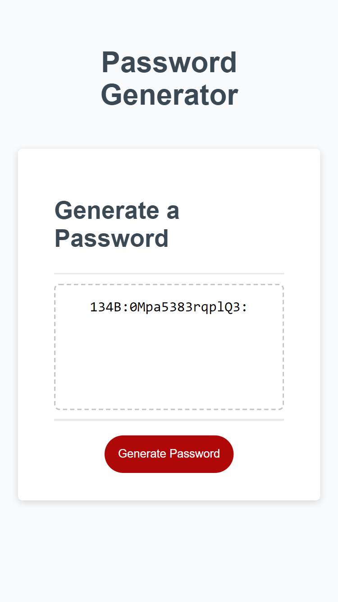

# js-password-generator
Challenge 5 of edX Boot Camp (Front End) to create Javascript Password Generator.

## Description

For Weekly Challenge 5 of the edX Bootcamp Front End Course, I was given 
a task of writing Javascript code for generating a random password based on criteria the user selected
(ie. length of password, allow lowercase, uppercase, numeric and special characters).

> What was my motivation?

My motivation was to accelerate my front end skills in web development so I can successsfully secure a web development job. 
I am building on my skills and each week I'm growing from strength to strength. 

>Why I built this project?

Building the website helped me to bridge the gap between theoretical knowledge and practical of applying
my Javascript knowledge that I learnt in Week 5.

> What problem did it solve?

It solved the problem of creating a unique password that would be difficult to crack.

> What did I learn?

I learnt how to write Javascript that is clean, readable, with comments and is maintainable. I researched advanced topics
like regular expressions and implemented this within testing numeric input. I applied the knowledge of Conditional statements (if and else, switch), Loops (while and for), arrays, used functions for separating concerns and for reusage. I was pleased to use objects 
in this assignment.

> What makes my project stand out? 

It stands out as I have successfully completed the exercise, used good programming practice, in terms of writing clean code.
I have used appropriate constants and variables that are understandable. There are comments throughout the code
so it can be understood by any developer. I noticed that the basic methods in Javascript allowed expressions like '8m'
to be classed as a valid number. Due to this I decided to use regular expressions to make my code water tight. I have
pushed myself continually ensuring my work is of the highest quality. The code is readable and maintainable.

> Technologies Used

* HTML
* Javascript

> Tools Used

* Microsoft Windows 11
* Visual Studio Code
* Git and GitBash
* Git Lab
* Git Hub
* Slack
* Google Chrome Browser
* Notepad
* Windows File Explorer
* Microsoft Paint

## Installation

The GitHub repository for my Password Generator can be found at: https://github.com/timsbootcamp/js-password-generator

The source code can be cloned from the above link. 

## Usage

Link to my GitHub Repository: https://github.com/timsbootcamp/js-password-generator

Link to deployed site of my solution to Week 5 : Password Generator Challenge : https://timsbootcamp.github.io/js-password-generator/

## Credits

https://www.w3schools.com/js/js_regexp.asp

https://www.w3schools.com/jsref/jsref_regexp_not_0-9.asp

